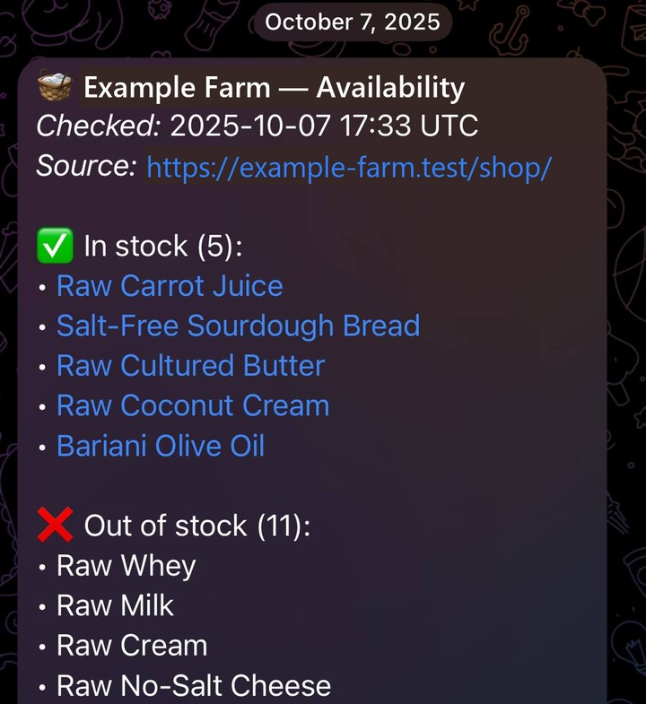

# Farm Availability Bot

I wrote this bot so I wouldn't have to keep reloading a farm shop's catalog page to see what's in stock. It reads the page and sends the result to Telegram, and it can message me when a product I'm watching comes back.

It ran on cloud hosting for about a year, for me and a few friends. The bot is no longer hosted, so this repository is for reading the code.



A report from October 2025, when the bot was running. I replaced the farm's name and link with placeholders.

## What it does

- Reads the shop's catalog page and marks each product as in stock or out of stock.
- Sends a stock report to Telegram, on request or at a daily time each chat sets.
- `/watch <product>` adds a product to a chat's watch list. The bot re-reads the catalog every 15 minutes and messages the chat when a watched product comes back, sells out, appears or is removed.
- Never sends the same alert twice, also after a restart. The last stock state and the last alert per chat are saved to a file.

## How it's built

Python, BeautifulSoup and `python-telegram-bot`.

- `shop_notifier.py` fetches and parses the page and formats the report.
- `bot_polling.py` is the bot: commands, daily reports and the repeating stock check.
- `stock_watch.py` compares two catalog reads and decides which alerts are new.

Schedules, watch lists and stock state are plain JSON files.

## Run

Python 3.10 or newer, and a bot token from Telegram's BotFather.

```bash
python -m venv .venv
.venv\Scripts\activate          # Windows; on Linux/macOS: source .venv/bin/activate
pip install -r requirements.txt
cp .env.example .env             # then fill in the token and the shop URL
run.bat                          # the bot (./run.sh on Linux/macOS)
run.bat once                     # send a single report and exit
```

## Test

```bash
pytest
```

The tests use sample HTML and temporary files and make no network calls. They cover the parsing, each kind of stock change, and that alerts aren't repeated.

## Limitations

- The default shop URL is a placeholder, and the page selectors are written for WooCommerce-style catalog pages.
- A product is identified by its name, so a renamed product shows up as one removed and one new.
- A failed catalog read or Telegram send is logged and skipped, not retried.
- It was built for a few users: any chat can use the bot, and the JSON files have no locking.
